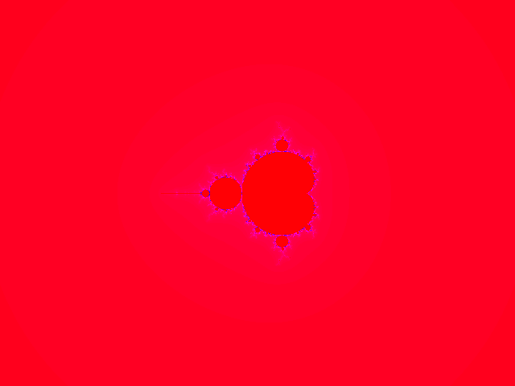

## FractalGenerator

Tool to generate fractal images.

```
Usage:
[-ASYNC][-CIMAG][-CREAL][-DEPTH][-FRACTAL][-H | HELP][-HEIGHT][-ITERATIONS][-LIGHT][-MIX][-OUTPUT][-PALETTE][-RADIUS][-WIDTH][-XCENTER][-YCENTER][-ZOOM]

-H | HELP         : Show this help message.

-ASYNC <boolean>  : Async. Set to 'true' to calculate multithreaded, 'false' for single thread. Default is 'true'.
-CIMAG <double>   : For Julia, you can set the imaginary value of C. Default: 0.75
-CREAL <double>   : For Julia, you can set the real value of C. Default: -0.2
-DEPTH <int>      : An integer representing the color depth (bits) of the image. Acceptable values: 8, 24, 32. Default: 24
-FRACTAL <string> : Fractal variation. Acceptable values: Mandelbrot, Julia, Newton, Spiderweb. Default: Mandelbrot
-HEIGHT <int>     : Height of the image, in pixels. Must be a positive integer number. Default: 200
-ITERATIONS <int> : Iterations inside the algorithm. Must be a positive integer number. The bigger the number, the higher the contrast. Default: 256
-LIGHT <double>   : Light management (contrast). Must be a double number between 0.0 and 1.0. Default: 0
-OUTPUT <string>  : Output file. Must not have spaces, unless it is between quotation marks. Extension must be bmp. Default: output.bmp    
-PALETTE <string> : Mathlab base color palette file. Must ve a valid Mathlab palette, and must exist inside the palettes directory. Default:  hsv.txt
-MIX <string>     : Optional extra Mathlab color palette that will be mixed with the base palette file. Must ve a valid Mathlab palette, and must exist inside the palettes directory. Default is empty.
-RADIUS <double>  : Escaping radius limit. Must be a positive double number. If fractal is Newton, must be a float number < 1.0. Default: 1E+20
-WIDTH <int>      : Width of the image, in pixels, must be a positive integer number. Default: 320
-XCENTER <double> : The x coordinate of the point to zoom in the plane. Default: 0.
-YCENTER <double> : The y coordinate of the point to zoom in the plane. Default: 0.
-ZOOM <double>    : The amount of zoom on the image. The default is 1.
```

Examples:


